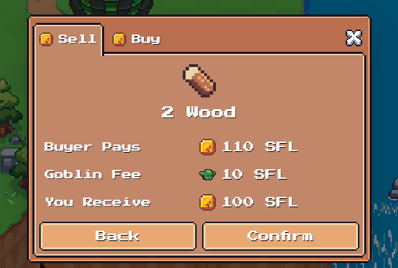
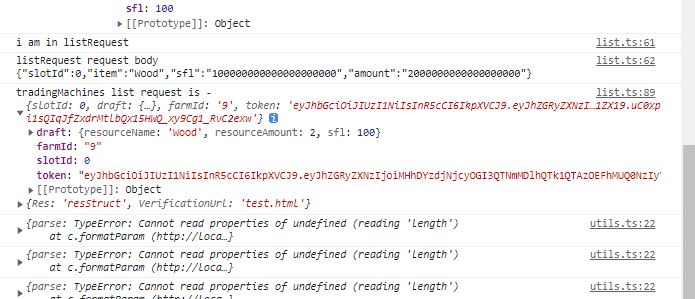

todo:

bumkin.sol

img_16.png
返回的 bumpkin onchain 数据
[52,0xfd03B2E5743723Ab20E9edf392341Dad0EC3C236,1666687994,0xfd03B2E5743723Ab20E9edf392341Dad0EC3C236,
0x8Be69CAA09446265E3328f8Aef5F0542e0296204,]

0xfd03B2E5743723Ab20E9edf392341Dad0EC3C236 account22
[creatat :1666687994 ,
creaBy:0xfd03B2E5743723Ab20E9edf392341Dad0EC3C236,
owner:0xfd03B2E5743723Ab20E9edf392341Dad0EC3C236,
tokenId : 52 ,
tokenUri:"https://api-dev.sunflower-land.com/bumpkins/metadata/52_v1_32_3_50_15_19_22_45",
wardrobe:0x8Be69CAA09446265E3328f8Aef5F0542e0296204
]

event.data?.state.bumpkin,:
bumkin initialBumpkinState :

[
archivement :[busy Bumkin :1],
activity:{},
equipped:[backgroud: Farm Backgroud,
body :"light grown farmer Potion, hai: basic pants ,shirts : red,farmer,shirt ,shoes:black,farmer,boots,
tool:farmer pitchFork],
experience:0,
skill:{},
stamina:{vale:10,replenshedat:0}
tokenUri:"bla"
]

payload parts:
body: 'Beige Farmer Potion', hair: 'Rancher Hair', shirt: 'Red Farmer Shirt'
body: 'Dark Brown Farmer Potion', hair: 'Explorer Hair', shirt: 'Red Farmer Shirt'
-- 索引：ITEM_IDS

tradingPost

slotId 0 draft {resourceName: 'Wood', resourceAmount: 2, sfl: 100}

[//]: # console.log(
"listRequest request body ",
JSON.stringify({
slotId: request.slotId,
item: request.draft.resourceName,
sfl: toWei(String(request.draft.sfl)),
amount: toWei(
String(request.draft.resourceAmount),
getItemUnit(request.draft.resourceName)
),
})
);()

{"slotId":0,"item":"Wood","sfl":"100000000000000000000","amount":"2000000000000000000"}

question:
1 what is slotId ? -
autosave 的 response 由后端进行 数据的 curd
makeGame 将 curd 更新到 farm state 中
所以 第一次创建 farm 的时候应该在 服务器中存储 initialFarm sate
后续 save 改变的是 服务器的 json 数据

after creat farm,ui need to load coundown page
bans api can mange the user farm to load or not
0 修改 config，如果沒有會直接進入農場頁面
initial: API_URL ? "loadingFarm" : "authorised",

[5, 12, 502, 1, 1, 100, 100, 15, 1, 3, 1, 3, 3, 5, 50, 1, 1, 1, 3, 1, 1, 1]
[201, 202, 204, 502, 508, 209, 210, 605, 307, 301, 911, 302, 303, 304, 713, 1102, 920, 714, 515, 519 ,505 ,501]

[101,102,103,104,105,106,107,108,109,110,111,112,113,114,115,116,117,201,202,203,204,205,206,207,208,209,210,211,301,302,303,304,305,306,307,308,401,402,403,404,405,406,407,408,409,410,411,412,413,414,415,416,417,418,419,420,421,422,423,424,425,426,427,428,429,430,431,501,502,503,504,505,506,507,508,509,510,511,512,513,514,515,516,517,518,519,601,602,603,604,605,606,607,608,609,610,611,612,613,701,702,703,704,705,706,707,708,709,710,711,712,713,714,801,802,803,804,805,806,807,808,809,810,811,812,813,814,815,816,817,818,819,820,821,822,823,824,825,826,827,828,829,830,831,832,833,834,835,836,837,838,839,840,841,842,901,902,903,904,905,906,907,908,909,910,911,912,913,914,915,916,917,918,919,920,921,922,1001,1002,1003,1004,1005,1006,1007,1008,1009,1101,1102,1103,1104,1105,1106,1107,1108,1109,1110,1111,1112,1113,1114,1201]
[100000000100000000100000000100000000,100000000100000000100000000100000000,100000000100000000100000000100000000,100000000100000000100000000100000000,100000000100000000100000000100000000,100000000100000000100000000100000000,100000000100000000100000000100000000,100000000100000000100000000100000000,100000000100000000100000000100000000,100000000100000000100000000100000000,100000000100000000100000000100000000,100000000100000000100000000100000000,100000000100000000100000000100000000,100000000100000000100000000100000000,100000000100000000100000000100000000,100000000100000000100000000100000000,100000000100000000100000000100000000,100000000100000000100000000100000000,100000000100000000100000000100000000,100000000100000000100000000100000000,100000000100000000100000000100000000,100000000100000000100000000100000000,100000000100000000100000000100000000,100000000100000000100000000100000000,100000000100000000100000000100000000,100000000100000000100000000100000000,100000000100000000100000000100000000,100000000100000000100000000100000000,100000000100000000100000000100000000,100000000100000000100000000100000000,100000000100000000100000000100000000,100000000100000000100000000100000000,100000000100000000100000000100000000,100000000100000000100000000100000000,100000000100000000100000000100000000,100000000100000000100000000100000000,100000000100000000100000000100000000,100000000100000000100000000100000000,100000000100000000100000000100000000,100000000100000000100000000100000000,100000000100000000100000000100000000,100000000100000000100000000100000000,100000000100000000100000000100000000,100000000100000000100000000100000000,100000000100000000100000000100000000,100000000100000000100000000100000000,100000000100000000100000000100000000,100000000100000000100000000100000000,100000000100000000100000000100000000,100000000100000000100000000100000000,100000000100000000100000000100000000,100000000100000000100000000100000000,100000000100000000100000000100000000,100000000100000000100000000100000000,100000000100000000100000000100000000,100000000100000000100000000100000000,100000000100000000100000000100000000,100000000100000000100000000100000000,100000000100000000100000000100000000,100000000100000000100000000100000000,100000000100000000100000000100000000,100000000100000000100000000100000000,100000000100000000100000000100000000,100000000100000000100000000100000000,100000000100000000100000000100000000,100000000100000000100000000100000000,100000000100000000100000000100000000,100000000100000000100000000100000000,100000000100000000100000000100000000,100000000100000000100000000100000000,100000000100000000100000000100000000,100000000100000000100000000100000000,100000000100000000100000000100000000,100000000100000000100000000100000000,100000000100000000100000000100000000,100000000100000000100000000100000000,100000000100000000100000000100000000,100000000100000000100000000100000000,100000000100000000100000000100000000,100000000100000000100000000100000000,100000000100000000100000000100000000,100000000100000000100000000100000000,100000000100000000100000000100000000,100000000100000000100000000100000000,100000000100000000100000000100000000,100000000100000000100000000100000000,100000000100000000100000000100000000,100000000100000000100000000100000000,100000000100000000100000000100000000,100000000100000000100000000100000000,100000000100000000100000000100000000,100000000100000000100000000100000000,100000000100000000100000000100000000,100000000100000000100000000100000000,100000000100000000100000000100000000,100000000100000000100000000100000000,100000000100000000100000000100000000,100000000100000000100000000100000000,100000000100000000100000000100000000,100000000100000000100000000100000000,100000000100000000100000000100000000,100000000100000000100000000100000000,100000000100000000100000000100000000,100000000100000000100000000100000000,100000000100000000100000000100000000,100000000100000000100000000100000000,100000000100000000100000000100000000,100000000100000000100000000100000000,100000000100000000100000000100000000,100000000100000000100000000100000000,100000000100000000100000000100000000,100000000100000000100000000100000000,100000000100000000100000000100000000,100000000100000000100000000100000000,100000000100000000100000000100000000,100000000100000000100000000100000000,100000000100000000100000000100000000,100000000100000000100000000100000000,100000000100000000100000000100000000,100000000100000000100000000100000000,100000000100000000100000000100000000,100000000100000000100000000100000000,100000000100000000100000000100000000,100000000100000000100000000100000000,100000000100000000100000000100000000,100000000100000000100000000100000000,100000000100000000100000000100000000,100000000100000000100000000100000000,100000000100000000100000000100000000,100000000100000000100000000100000000,100000000100000000100000000100000000,100000000100000000100000000100000000,100000000100000000100000000100000000,100000000100000000100000000100000000,100000000100000000100000000100000000,100000000100000000100000000100000000,100000000100000000100000000100000000,100000000100000000100000000100000000,100000000100000000100000000100000000,100000000100000000100000000100000000,100000000100000000100000000100000000,100000000100000000100000000100000000,100000000100000000100000000100000000,100000000100000000100000000100000000,100000000100000000100000000100000000,100000000100000000100000000100000000,100000000100000000100000000100000000,100000000100000000100000000100000000,100000000100000000100000000100000000,100000000100000000100000000100000000,100000000100000000100000000100000000,100000000100000000100000000100000000,100000000100000000100000000100000000,100000000100000000100000000100000000,100000000100000000100000000100000000,100000000100000000100000000100000000,100000000100000000100000000100000000,100000000100000000100000000100000000,100000000100000000100000000100000000,100000000100000000100000000100000000,100000000100000000100000000100000000,100000000100000000100000000100000000,100000000100000000100000000100000000,100000000100000000100000000100000000,100000000100000000100000000100000000,100000000100000000100000000100000000,100000000100000000100000000100000000,100000000100000000100000000100000000,100000000100000000100000000100000000,100000000100000000100000000100000000,100000000100000000100000000100000000,100000000100000000100000000100000000,100000000100000000100000000100000000,100000000100000000100000000100000000,100000000100000000100000000100000000,100000000100000000100000000100000000,100000000100000000100000000100000000,100000000100000000100000000100000000,100000000100000000100000000100000000,100000000100000000100000000100000000,100000000100000000100000000100000000,100000000100000000100000000100000000,100000000100000000100000000100000000,100000000100000000100000000100000000,100000000100000000100000000100000000,100000000100000000100000000100000000,100000000100000000100000000100000000,100000000100000000100000000100000000,100000000100000000100000000100000000,100000000100000000100000000100000000,100000000100000000100000000100000000,100000000100000000100000000100000000,100000000100000000100000000100000000,100000000100000000100000000100000000,100000000100000000100000000100000000,100000000100000000100000000100000000,100000000100000000100000000100000000,100000000100000000100000000100000000,100000000100000000100000000100000000,100000000100000000100000000100000000,100000000100000000100000000100000000]

[{ enabled: true, mintId: 1, ingredientIds: [601], ingredientAmounts: [601], maxSupply: 1000, cooldownSeconds: 60, tokenAmount: 0, }
fertilisers

[[[1, [601],  [601],  1000,   60, 0 , true]]
]()[[836, [601],  [1],  1000,   60, 0 , true]]
[[401, [601],  [1],  1000,   60, 0 , true]]

需要改 loginrequets（）

        const { data } = await response.json();
        // console.log("a", a);
        const { token } = data;
    token連續解構賦值
