todo:

bumkin.sol

absolute z-10 hover:img-highlight cursor-pointer
2
session
loadSession get api 返回的数据为固定的原始数据返回
所以 要怎么将 ts 的解构数据转换为 go 的 json 数据，
再进行转换
所以 官方的应该用的 nodejs 后端
3 autosAve 有 api 后面回来的 response
怎么再转化为 gameState

4
autosave 的 response 由后端进行 数据的 curd
makeGame 将 curd 更新到 farm state 中
所以 第一次创建 farm 的时候应该在 服务器中存储 initialFarm sate
后续 save 改变的是 服务器的 json 数据
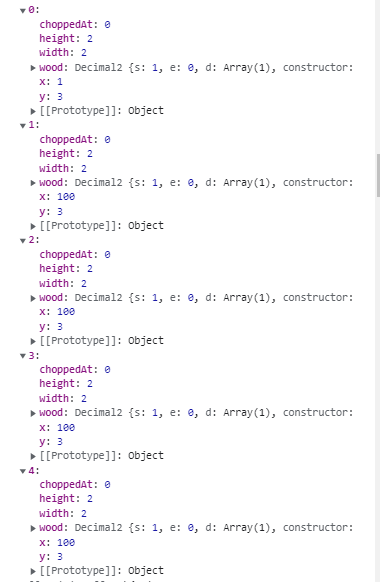
after creat farm,ui need to load coundown page
bans api can mange the user farm to load or not
0 修改 config，如果沒有會直接進入農場頁面
initial: API_URL ? "loadingFarm" : "authorised",

[5, 12, 502, 1, 1, 100, 100, 15, 1, 3, 1, 3, 3, 5, 50, 1, 1, 1, 3, 1, 1, 1]
[201, 202, 204, 502, 508, 209, 210, 605, 307, 301, 911, 302, 303, 304, 713, 1102, 920, 714, 515, 519 ,505 ,501]

[101,102,103,104,105,106,107,108,109,110,111,112,113,114,115,116,117,201,202,203,204,205,206,207,208,209,210,211,301,302,303,304,305,306,307,308,401,402,403,404,405,406,407,408,409,410,411,412,413,414,415,416,417,418,419,420,421,422,423,424,425,426,427,428,429,430,431,501,502,503,504,505,506,507,508,509,510,511,512,513,514,515,516,517,518,519,601,602,603,604,605,606,607,608,609,610,611,612,613,701,702,703,704,705,706,707,708,709,710,711,712,713,714,801,802,803,804,805,806,807,808,809,810,811,812,813,814,815,816,817,818,819,820,821,822,823,824,825,826,827,828,829,830,831,832,833,834,835,836,837,838,839,840,841,842,901,902,903,904,905,906,907,908,909,910,911,912,913,914,915,916,917,918,919,920,921,922,1001,1002,1003,1004,1005,1006,1007,1008,1009,1101,1102,1103,1104,1105,1106,1107,1108,1109,1110,1111,1112,1113,1114,1201]
[100000000100000000100000000100000000,100000000100000000100000000100000000,100000000100000000100000000100000000,100000000100000000100000000100000000,100000000100000000100000000100000000,100000000100000000100000000100000000,100000000100000000100000000100000000,100000000100000000100000000100000000,100000000100000000100000000100000000,100000000100000000100000000100000000,100000000100000000100000000100000000,100000000100000000100000000100000000,100000000100000000100000000100000000,100000000100000000100000000100000000,100000000100000000100000000100000000,100000000100000000100000000100000000,100000000100000000100000000100000000,100000000100000000100000000100000000,100000000100000000100000000100000000,100000000100000000100000000100000000,100000000100000000100000000100000000,100000000100000000100000000100000000,100000000100000000100000000100000000,100000000100000000100000000100000000,100000000100000000100000000100000000,100000000100000000100000000100000000,100000000100000000100000000100000000,100000000100000000100000000100000000,100000000100000000100000000100000000,100000000100000000100000000100000000,100000000100000000100000000100000000,100000000100000000100000000100000000,100000000100000000100000000100000000,100000000100000000100000000100000000,100000000100000000100000000100000000,100000000100000000100000000100000000,100000000100000000100000000100000000,100000000100000000100000000100000000,100000000100000000100000000100000000,100000000100000000100000000100000000,100000000100000000100000000100000000,100000000100000000100000000100000000,100000000100000000100000000100000000,100000000100000000100000000100000000,100000000100000000100000000100000000,100000000100000000100000000100000000,100000000100000000100000000100000000,100000000100000000100000000100000000,100000000100000000100000000100000000,100000000100000000100000000100000000,100000000100000000100000000100000000,100000000100000000100000000100000000,100000000100000000100000000100000000,100000000100000000100000000100000000,100000000100000000100000000100000000,100000000100000000100000000100000000,100000000100000000100000000100000000,100000000100000000100000000100000000,100000000100000000100000000100000000,100000000100000000100000000100000000,100000000100000000100000000100000000,100000000100000000100000000100000000,100000000100000000100000000100000000,100000000100000000100000000100000000,100000000100000000100000000100000000,100000000100000000100000000100000000,100000000100000000100000000100000000,100000000100000000100000000100000000,100000000100000000100000000100000000,100000000100000000100000000100000000,100000000100000000100000000100000000,100000000100000000100000000100000000,100000000100000000100000000100000000,100000000100000000100000000100000000,100000000100000000100000000100000000,100000000100000000100000000100000000,100000000100000000100000000100000000,100000000100000000100000000100000000,100000000100000000100000000100000000,100000000100000000100000000100000000,100000000100000000100000000100000000,100000000100000000100000000100000000,100000000100000000100000000100000000,100000000100000000100000000100000000,100000000100000000100000000100000000,100000000100000000100000000100000000,100000000100000000100000000100000000,100000000100000000100000000100000000,100000000100000000100000000100000000,100000000100000000100000000100000000,100000000100000000100000000100000000,100000000100000000100000000100000000,100000000100000000100000000100000000,100000000100000000100000000100000000,100000000100000000100000000100000000,100000000100000000100000000100000000,100000000100000000100000000100000000,100000000100000000100000000100000000,100000000100000000100000000100000000,100000000100000000100000000100000000,100000000100000000100000000100000000,100000000100000000100000000100000000,100000000100000000100000000100000000,100000000100000000100000000100000000,100000000100000000100000000100000000,100000000100000000100000000100000000,100000000100000000100000000100000000,100000000100000000100000000100000000,100000000100000000100000000100000000,100000000100000000100000000100000000,100000000100000000100000000100000000,100000000100000000100000000100000000,100000000100000000100000000100000000,100000000100000000100000000100000000,100000000100000000100000000100000000,100000000100000000100000000100000000,100000000100000000100000000100000000,100000000100000000100000000100000000,100000000100000000100000000100000000,100000000100000000100000000100000000,100000000100000000100000000100000000,100000000100000000100000000100000000,100000000100000000100000000100000000,100000000100000000100000000100000000,100000000100000000100000000100000000,100000000100000000100000000100000000,100000000100000000100000000100000000,100000000100000000100000000100000000,100000000100000000100000000100000000,100000000100000000100000000100000000,100000000100000000100000000100000000,100000000100000000100000000100000000,100000000100000000100000000100000000,100000000100000000100000000100000000,100000000100000000100000000100000000,100000000100000000100000000100000000,100000000100000000100000000100000000,100000000100000000100000000100000000,100000000100000000100000000100000000,100000000100000000100000000100000000,100000000100000000100000000100000000,100000000100000000100000000100000000,100000000100000000100000000100000000,100000000100000000100000000100000000,100000000100000000100000000100000000,100000000100000000100000000100000000,100000000100000000100000000100000000,100000000100000000100000000100000000,100000000100000000100000000100000000,100000000100000000100000000100000000,100000000100000000100000000100000000,100000000100000000100000000100000000,100000000100000000100000000100000000,100000000100000000100000000100000000,100000000100000000100000000100000000,100000000100000000100000000100000000,100000000100000000100000000100000000,100000000100000000100000000100000000,100000000100000000100000000100000000,100000000100000000100000000100000000,100000000100000000100000000100000000,100000000100000000100000000100000000,100000000100000000100000000100000000,100000000100000000100000000100000000,100000000100000000100000000100000000,100000000100000000100000000100000000,100000000100000000100000000100000000,100000000100000000100000000100000000,100000000100000000100000000100000000,100000000100000000100000000100000000,100000000100000000100000000100000000,100000000100000000100000000100000000,100000000100000000100000000100000000,100000000100000000100000000100000000,100000000100000000100000000100000000,100000000100000000100000000100000000,100000000100000000100000000100000000,100000000100000000100000000100000000,100000000100000000100000000100000000,100000000100000000100000000100000000,100000000100000000100000000100000000,100000000100000000100000000100000000,100000000100000000100000000100000000,100000000100000000100000000100000000,100000000100000000100000000100000000,100000000100000000100000000100000000,100000000100000000100000000100000000,100000000100000000100000000100000000,100000000100000000100000000100000000,100000000100000000100000000100000000,100000000100000000100000000100000000,100000000100000000100000000100000000,100000000100000000100000000100000000,100000000100000000100000000100000000,100000000100000000100000000100000000,100000000100000000100000000100000000,100000000100000000100000000100000000,100000000100000000100000000100000000,100000000100000000100000000100000000,100000000100000000100000000100000000,100000000100000000100000000100000000]

[{ enabled: true, mintId: 1, ingredientIds: [601], ingredientAmounts: [601], maxSupply: 1000, cooldownSeconds: 60, tokenAmount: 0, }
fertilisers

[[[1, [601],  [601],  1000,   60, 0 , true]]
]()[[836, [601],  [1],  1000,   60, 0 , true]]
[[401, [601],  [1],  1000,   60, 0 , true]]

[//]: # 401()
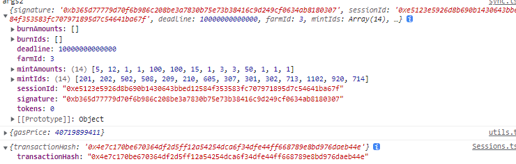
[100000000100000000100000000100000000,100000000100000000100000000100000000,100000000100000000100000000100000000,100000000100000000100000000100000000,100000000100000000100000000100000000,100000000100000000100000000100000000,100000000100000000100000000100000000,100000000100000000100000000100000000,100000000100000000100000000100000000,100000000100000000100000000100000000,100000000100000000100000000100000000,100000000100000000100000000100000000,100000000100000000100000000100000000,100000000100000000100000000100000000,100000000100000000100000000100000000,100000000100000000100000000100000000,100000000100000000100000000100000000,100000000100000000100000000100000000,100000000100000000100000000100000000,100000000100000000100000000100000000,100000000100000000100000000100000000,100000000100000000100000000100000000,100000000100000000100000000100000000,100000000100000000100000000100000000,100000000100000000100000000100000000,100000000100000000100000000100000000,100000000100000000100000000100000000,100000000100000000100000000100000000,100000000100000000100000000100000000,100000000100000000100000000100000000,100000000100000000100000000100000000,100000000100000000100000000100000000,100000000100000000100000000100000000,100000000100000000100000000100000000,100000000100000000100000000100000000,100000000100000000100000000100000000,100000000100000000100000000100000000,100000000100000000100000000100000000,100000000100000000100000000100000000,100000000100000000100000000100000000,100000000100000000100000000100000000,100000000100000000100000000100000000,100000000100000000100000000100000000,100000000100000000100000000100000000,100000000100000000100000000100000000,100000000100000000100000000100000000,100000000100000000100000000100000000,100000000100000000100000000100000000,100000000100000000100000000100000000,100000000100000000100000000100000000,100000000100000000100000000100000000,100000000100000000100000000100000000,100000000100000000100000000100000000,100000000100000000100000000100000000,100000000100000000100000000100000000,100000000100000000100000000100000000,100000000100000000100000000100000000,100000000100000000100000000100000000,100000000100000000100000000100000000,100000000100000000100000000100000000,100000000100000000100000000100000000,100000000100000000100000000100000000,100000000100000000100000000100000000,100000000100000000100000000100000000,100000000100000000100000000100000000,100000000100000000100000000100000000,100000000100000000100000000100000000,100000000100000000100000000100000000,100000000100000000100000000100000000,100000000100000000100000000100000000,100000000100000000100000000100000000,100000000100000000100000000100000000,100000000100000000100000000100000000,100000000100000000100000000100000000,100000000100000000100000000100000000,100000000100000000100000000100000000,100000000100000000100000000100000000,100000000100000000100000000100000000,100000000100000000100000000100000000,100000000100000000100000000100000000,100000000100000000100000000100000000,100000000100000000100000000100000000,100000000100000000100000000100000000,100000000100000000100000000100000000,100000000100000000100000000100000000,100000000100000000100000000100000000,100000000100000000100000000100000000,100000000100000000100000000100000000,100000000100000000100000000100000000,100000000100000000100000000100000000,100000000100000000100000000100000000,100000000100000000100000000100000000,100000000100000000100000000100000000,100000000100000000100000000100000000,100000000100000000100000000100000000,100000000100000000100000000100000000,100000000100000000100000000100000000,100000000100000000100000000100000000,100000000100000000100000000100000000,100000000100000000100000000100000000,100000000100000000100000000100000000,100000000100000000100000000100000000,100000000100000000100000000100000000,100000000100000000100000000100000000,100000000100000000100000000100000000,100000000100000000100000000100000000,100000000100000000100000000100000000,100000000100000000100000000100000000,100000000100000000100000000100000000,100000000100000000100000000100000000,100000000100000000100000000100000000,100000000100000000100000000100000000,100000000100000000100000000100000000,100000000100000000100000000100000000,100000000100000000100000000100000000,100000000100000000100000000100000000,100000000100000000100000000100000000,100000000100000000100000000100000000,100000000100000000100000000100000000,100000000100000000100000000100000000,100000000100000000100000000100000000,100000000100000000100000000100000000,100000000100000000100000000100000000,100000000100000000100000000100000000,100000000100000000100000000100000000,100000000100000000100000000100000000,100000000100000000100000000100000000,100000000100000000100000000100000000,100000000100000000100000000100000000,100000000100000000100000000100000000,100000000100000000100000000100000000,100000000100000000100000000100000000,100000000100000000100000000100000000,100000000100000000100000000100000000,100000000100000000100000000100000000,100000000100000000100000000100000000,100000000100000000100000000100000000,100000000100000000100000000100000000,100000000100000000100000000100000000,100000000100000000100000000100000000,100000000100000000100000000100000000,100000000100000000100000000100000000,100000000100000000100000000100000000,100000000100000000100000000100000000,100000000100000000100000000100000000,100000000100000000100000000100000000,100000000100000000100000000100000000,100000000100000000100000000100000000,100000000100000000100000000100000000,100000000100000000100000000100000000,100000000100000000100000000100000000,100000000100000000100000000100000000,100000000100000000100000000100000000,100000000100000000100000000100000000,100000000100000000100000000100000000,100000000100000000100000000100000000,100000000100000000100000000100000000,100000000100000000100000000100000000,100000000100000000100000000100000000,100000000100000000100000000100000000,100000000100000000100000000100000000,100000000100000000100000000100000000,100000000100000000100000000100000000,100000000100000000100000000100000000,100000000100000000100000000100000000,100000000100000000100000000100000000,100000000100000000100000000100000000,100000000100000000100000000100000000,100000000100000000100000000100000000,100000000100000000100000000100000000,100000000100000000100000000100000000,100000000100000000100000000100000000,100000000100000000100000000100000000,100000000100000000100000000100000000,100000000100000000100000000100000000,100000000100000000100000000100000000,100000000100000000100000000100000000,100000000100000000100000000100000000,100000000100000000100000000100000000,100000000100000000100000000100000000,100000000100000000100000000100000000,100000000100000000100000000100000000,100000000100000000100000000100000000,100000000100000000100000000100000000,100000000100000000100000000100000000,100000000100000000100000000100000000,100000000100000000100000000100000000,100000000100000000100000000100000000,100000000100000000100000000100000000,100000000100000000100000000100000000,100000000100000000100000000100000000,100000000100000000100000000100000000,100000000100000000100000000100000000,100000000100000000100000000100000000,100000000100000000100000000100000000,100000000100000000100000000100000000,100000000100000000100000000100000000,100000000100000000100000000100000000,100000000100000000100000000100000000,100000000100000000100000000100000000,100000000100000000100000000100000000]

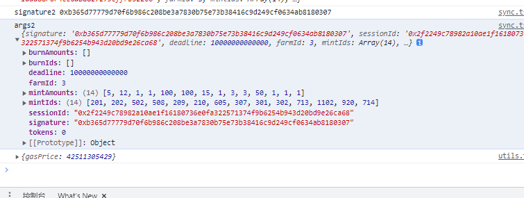

[//]: # "0x3B77988b656d98539F15daA02d7259401d1Bc647,2"

重试一次部署合约 - 初始化链上合约后，再次增加 tokenbalance 失败

2 towei 的 错误？
react 计算的是 16.87 传输时 增加 16.87 \* 100 = 1687 ，得到 1687
页面显示 1687/ 100

3 go 部署 react

4 react

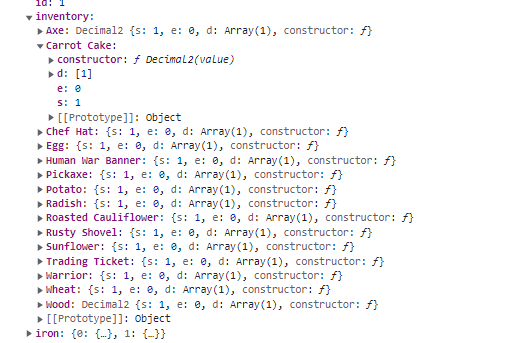
3 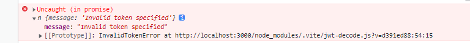
需要改 loginrequets（）

        const { data } = await response.json();
        // console.log("a", a);
        const { token } = data;
    token連續解構賦值

3.2 signTransaction data 字段 連續賦值
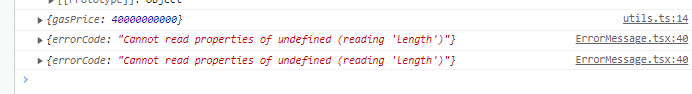

3.3
creatFarm 後的查詢 txhash 和 receipt

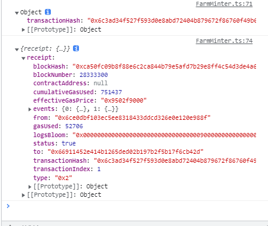
1 修改 login 方法 ，增加 getUserFarmStatus 方法，擋在

2 loadFarm 時，第一次返回的是 測試數據  
 farmId: 58,
address: "0x6cE0Dbf103eC5EE8318433DdcD326E0E120e988f",
createdAt: Date.now() / 1000,
isBlacklisted: false,
verificationUrl: "ds",
第二次返回的數據是 createdAt: 11, 這樣可以通過 custDown 等鑄造 nft 農場的 ui 界面

4 
時間修改
auth/compoments/countDown.tsx
5
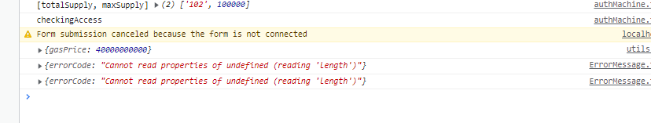
6
loadSession

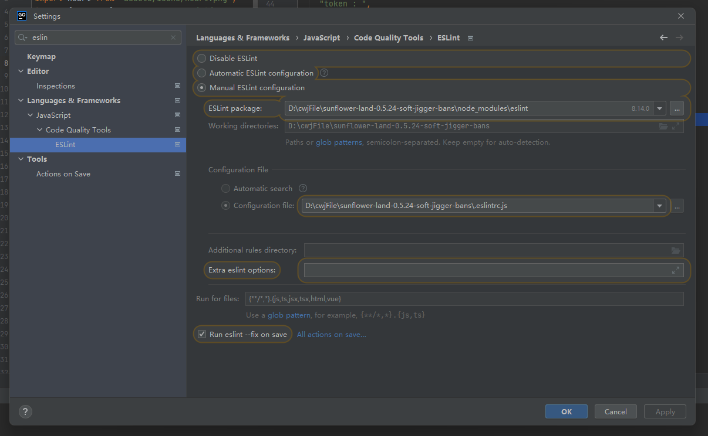
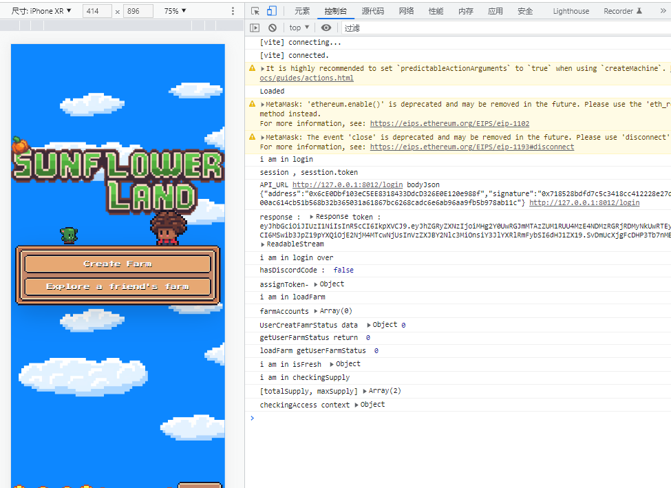

2020/10/10 笔记[//]: # ()
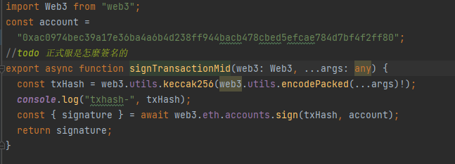
此处采用的 写死了 的私钥 导致 一直 beta unahorise
所以 要对签名的方法进行修改
或者在合约中增加一个 public 方法 作为 签名
由于是 beta 合约调用了 farm 的 mint 方法
，所以会说 没 game joiner，要在 farmland 合约里是指 权限 addGame（）
3
