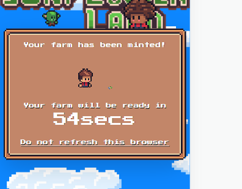

0 修改 config，如果沒有會直接進入農場頁面
initial: API_URL ? "loadingFarm" : "authorised",

3 
需要改 loginrequets（）

        const { data } = await response.json();
        // console.log("a", a);
        const { token } = data;
    token連續解構賦值

3.2 signTransaction data 字段 連續賦值

3.3
creatFarm 後的查詢 txhash 和 receipt

1 修改 login 方法 ，增加 getUserFarmStatus 方法，擋在

2 loadFarm 時，第一次返回的是 測試數據  
 farmId: 58,
address: "0x6cE0Dbf103eC5EE8318433DdcD326E0E120e988f",
createdAt: Date.now() / 1000,
isBlacklisted: false,
verificationUrl: "ds",
第二次返回的數據是 createdAt: 11, 這樣可以通過 custDown 等鑄造 nft 農場的 ui 界面

4 
時間修改
auth/compoments/countDown.tsx
5

6
loadSession

